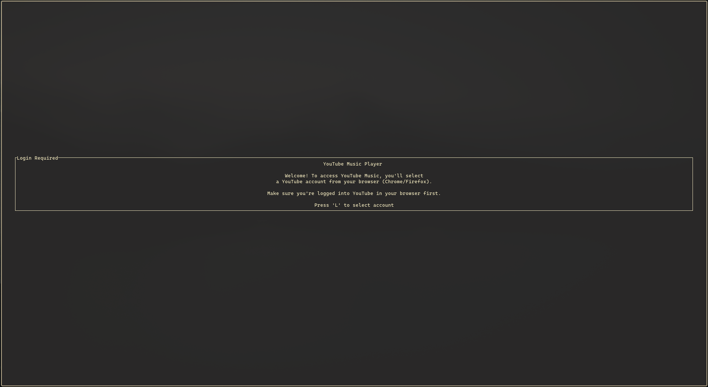
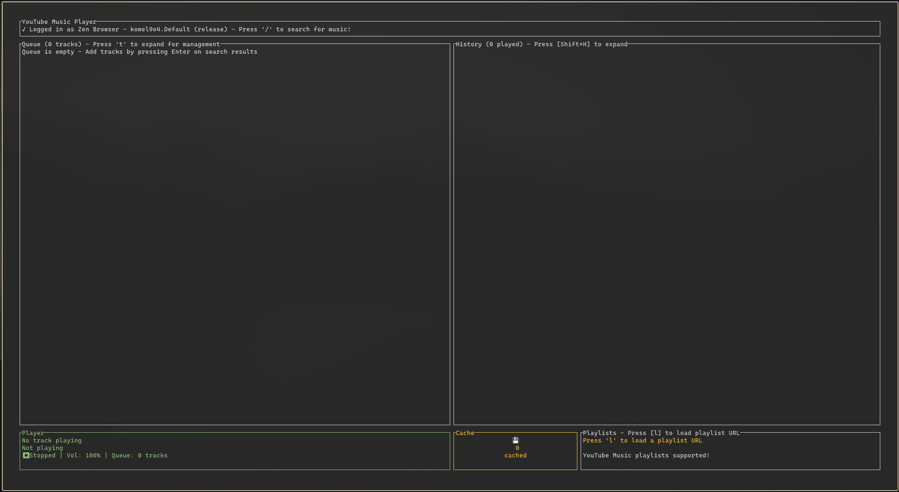
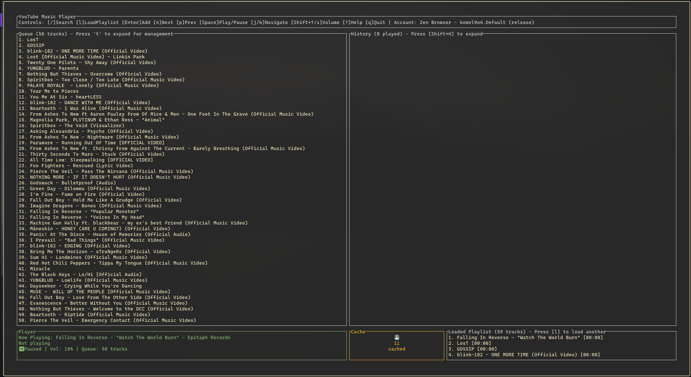
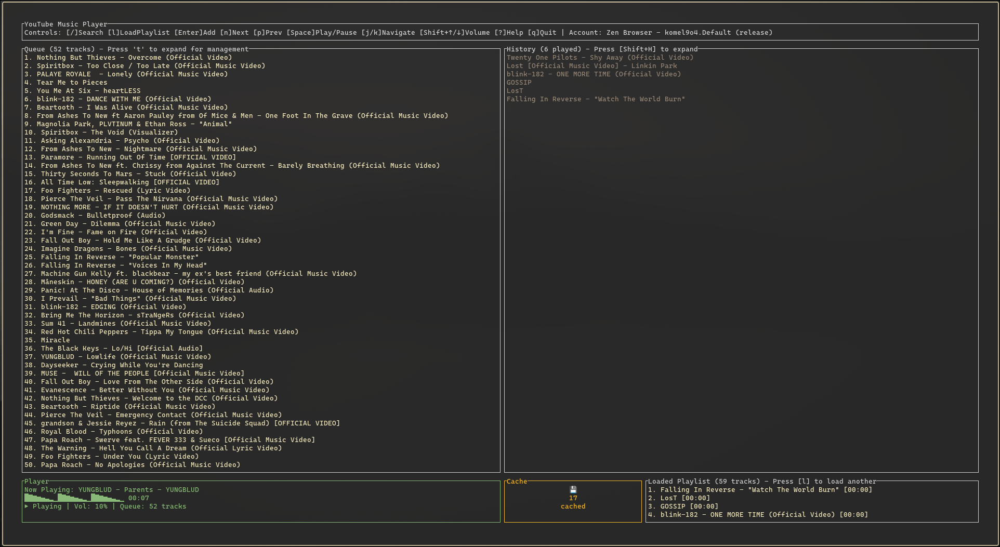

<div align="center">
  
  <p><i>A terminal-based YouTube Music player written in Rust</i></p>
</div>

---

## About

A terminal YouTube Music player built in Rust. Uses `yt-dlp` for extraction and `rodio` for playback, wrapped in a `ratatui` TUI. Started as a learning project, now a full-featured local music client.

---

## Screenshots

<div align="center">
  
  <p><i>Browser account selection</i></p>
</div>

<div align="center">
  
  <p><i>Home screen after login</i></p>
</div>

<div align="center">
  
  <p><i>Playlist loaded with tracks queued</i></p>
</div>

<div align="center">
  
  <p><i>Music playing with history</i></p>
</div>

---

## Features

### Playback
- Play/Pause, Next, Previous, Seek (±10s)
- Volume control (±1% or ±5% with Shift), persisted across sessions
- Resume playback position on restart
- Background pre-downloading of upcoming tracks (lookahead)
- Persistent download cache — cached tracks play instantly on restart
- Music-only filter (`Shift+F`) — filters tracks >7 min, toggle off for podcasts/long mixes

### Search & Playlists
- Search YouTube for songs and videos
- Load any YouTube or YouTube Music playlist URL directly
- Queue management with history, delete, and clear

### YouTube Music Feed Browser
- Browse your **full library** directly in the TUI — Saved Mixes, owned playlists, saved playlists, Liked Music
- Fetches from `youtube.com/feed/playlists` — returns everything in your library in one request
- **Three-column navigation**: Sections (left) → Items (middle) → Tracks (right), vim-style `h/l` to move between columns
- **Expand any playlist** to see individual tracks and cherry-pick what to add
- Add a single track to the queue or play it immediately
- Add an entire playlist to the queue in one action — duplicates automatically skipped
- Status bar shows action feedback (added count, duplicates skipped, filtered count)
- 30-minute disk cache (`feed_cache.json`) — reopening the feed is instant
- Force-refresh with `r` to bypass the cache
- Fetches via browser cookies — no OAuth, no API keys required

### Authentication
- Browser cookie auth — Chrome, Chromium, Firefox, Zen Browser (multi-profile)
- Account switcher accessible at any time (`o` key) — switch profiles or log out
- Selected account persisted across sessions

### Persistence & Reliability
- All state files written atomically (`tempfile` + `rename`) — no torn writes on crash
- Generic `CacheStore<T>` with TTL and schema versioning for all cached data
- History, queue, download cache, playback position all survive restarts
- File permissions restricted to `0o600` (owner read/write only)

---

## Tech Stack

| Component | Library |
|-----------|---------|
| **TUI** | `ratatui` + `crossterm` |
| **Async** | `tokio` |
| **YouTube** | `yt-dlp` (subprocess) |
| **Audio** | `rodio` (pure Rust) |
| **JSON** | `serde` + `serde_json` |
| **Atomic writes** | `tempfile` |

---

## Installation

### Dependencies

```bash
# yt-dlp (required)
yay -S yt-dlp          # Arch/Manjaro
# or: pip install yt-dlp

# Rust toolchain
sudo pacman -S rustup  # Arch/Manjaro
rustup default stable

# Other distros:
curl --proto '=https' --tlsv1.2 -sSf https://sh.rustup.rs | sh
```

### Build & Install

```bash
git clone https://github.com/jeppe119/Crusty.git
cd Crusty

# Build release binary
cargo build --release

# Run directly
./target/release/crusty

# Or install to PATH
cp target/release/crusty ~/.local/bin/crusty
```

### First Run

1. Make sure you are **logged into YouTube** in Chrome, Chromium, Firefox, or Zen Browser
2. Launch Crusty — you will be prompted to select a browser account
3. Press `l` to open the account picker and select your profile
4. Press `/` to search, `l` to load a playlist URL, or `f` to open the feed browser

---

## Keyboard Shortcuts

### Playback

| Key | Action |
|-----|--------|
| `Space` | Play / Pause |
| `n` | Next track |
| `p` | Previous track |
| `↑` / `Shift+↑` | Volume up +1% / +5% |
| `↓` / `Shift+↓` | Volume down -1% / -5% |
| `→` | Seek forward 10s |
| `←` | Seek backward 10s |

### Navigation & Queue

| Key | Action |
|-----|--------|
| `j / k` | Navigate lists down / up |
| `Enter` | Add selected item to queue |
| `t` | Toggle queue expand |
| `d` | Delete selected item (queue expanded) |
| `m` | Toggle My Mix expand |
| `Shift+M` | Refresh My Mix (when expanded) |
| `Shift+H` | Toggle history expand |
| `Shift+C` | Clear history (when expanded) |
| `h` | Go to Home view |
| `Esc` | Return to previous view |

### Feed Browser

| Key | Action |
|-----|--------|
| `f` | Open YouTube Music Feed Browser |
| `j / k` | Navigate sections (left column) or items (middle) or tracks (right) |
| `l` / `→` | Move focus right (Sections → Items → Tracks) |
| `h` / `←` | Move focus left / collapse track view |
| `Enter` | Expand playlist into tracks / Play selected track |
| `a` | Add whole playlist to queue / Add single track (track view) |
| `r` | Force-refresh feed (bypasses 30-min cache) |
| `Esc / f` | Close feed browser |

### Other

| Key | Action |
|-----|--------|
| `/` | Search YouTube |
| `l` | Load playlist from URL |
| `o` | Switch account / Log out |
| `Shift+F` | Toggle music-only filter (>7 min filtered) |
| `?` | Show help screen |
| `q` | Quit |

---

## Project Structure

```
Crusty/
├── Cargo.toml
├── README.md
├── assets/
│   ├── Crusty.png
│   └── screenshots/
├── docs/
└── src/
    ├── main.rs
    ├── config.rs               # Constants, paths, utilities
    │
    ├── player/
    │   ├── audio.rs            # Audio playback (rodio)
    │   └── queue.rs            # Queue & history management
    │
    ├── services/
    │   ├── cache_store.rs      # Generic TTL + schema-versioned file cache
    │   ├── download.rs         # Background download manager
    │   ├── feed.rs             # YouTube Music feed scraping (library, liked, mixes)
    │   ├── persistence.rs      # History/queue/state save/load (atomic JSON)
    │   └── playlist.rs         # Playlist fetching via yt-dlp
    │
    ├── youtube/
    │   ├── browser_auth.rs     # Browser cookie authentication
    │   └── extractor.rs        # yt-dlp search interface
    │
    └── ui/
        ├── app.rs              # Main TUI app (event loop, draw, channels)
        ├── input.rs            # Keyboard input → command pattern
        ├── state.rs            # UI state structs (feed, queue, search…)
        ├── playback.rs         # Play/pause/seek/volume
        ├── navigation.rs       # List cursor movement
        ├── actions.rs          # Search, playlist, feed, login actions
        └── views/              # Draw modules
            ├── feed.rs         # YouTube Music feed browser (3-column)
            ├── help.rs         # Help screen
            ├── history.rs      # Playback history
            ├── login.rs        # Login / account picker
            ├── player_bar.rs   # Now-playing bar
            ├── playlist.rs     # My Mix / loaded playlist
            ├── queue.rs        # Queue view
            └── search.rs       # Search results
```

---

## How the Feed Browser Works

Crusty fetches your full YouTube library from `youtube.com/feed/playlists` using your browser cookies. This single endpoint returns everything in one request:

| Type | ID prefix | Example |
|------|-----------|---------|
| Saved Mixes | `RDCLAK*`, `RDAMPL*` | YouTube Music curated playlists |
| Liked Music | `LM` | Your liked songs |
| Your playlists | `PL*` | Playlists you created |
| Saved playlists | `PL*` | Playlists saved from other creators |

System playlists (Watch Later, History) are filtered out automatically.

Track counts are not available from the listing endpoint — they appear after expanding a playlist with `Enter`.

---

## Known Issues

- YouTube API / yt-dlp changes can break extraction (update yt-dlp if things stop working: `pip install -U yt-dlp`)
- UI may not render well in very small terminals (minimum ~80×24 recommended)

---

## Contributing

PRs, issues, and forks are welcome.

---

## Resources

- [The Rust Book](https://doc.rust-lang.org/book/)
- [Rust by Example](https://doc.rust-lang.org/rust-by-example/)
- [Ratatui Docs](https://docs.rs/ratatui/)
- [Tokio Tutorial](https://tokio.rs/tokio/tutorial)
- [yt-dlp](https://github.com/yt-dlp/yt-dlp)

---

## License

MIT

---

> [!WARNING]
> **Use at your own risk.** Automating YouTube playback and downloading content via `yt-dlp` may violate [YouTube's Terms of Service](https://www.youtube.com/t/terms). This project is intended for personal, non-commercial use only. The authors take no responsibility for any account suspension, legal action, or other consequences arising from its use. Always respect copyright and the rights of content creators.

---

<div align="center">
  <p>Made by <a href="https://github.com/jeppe119">jeppe119</a></p>
</div>
