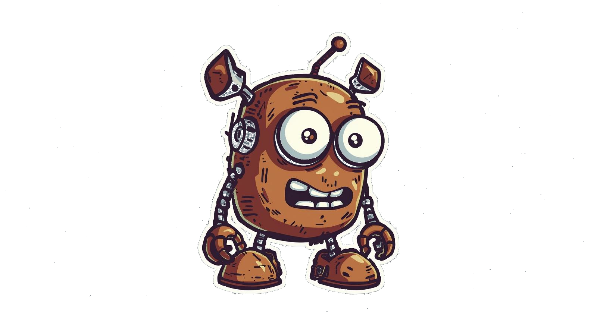

<div align="center">
  
  <p><i>Because scrolling through YouTube on your phone is too mainstream ¯\_(ツ)_/¯</i></p>
</div>

---

## What the hell is this?

A terminal-based YouTube music player that nobody asked for, but you're getting anyway. Built in Rust because apparently I hate myself and wanted to learn ownership and borrowing the hard way.

**TL;DR:** It's like Spotify, but worse! And in your terminal! And it uses YouTube! 🎉

**This is a Rust rewrite of a Python project** - perfect for Rust beginners who want to suffer through the borrow checker together.

---

## Why does this exist?

- ✅ I wanted to learn Rust (didn't really learn it, but it compiles!)
- ✅ I had too much free time
- ✅ Claude helped me... or maybe helped me fuck it up (hard to tell)
- ✅ Spite is a powerful motivator
- ❌ Nobody asked for this

---

## Features (that actually work)

- ✅ Search YouTube for songs/videos
- ✅ Smart caching (downloads to temp, auto-deletes after 5min)
- ✅ Background pre-downloading (buffer next tracks while you listen)
- ✅ Play/Pause/Skip controls (groundbreaking, I know)
- ✅ Volume control (revolutionary)
- ✅ Queue management with history
- ✅ Progress bar that actually shows progress
- ✅ Keyboard shortcuts (because mouse is for normies)
- ✅ Beautiful terminal UI (beauty is subjective)
- ✅ Auto-advance to next track (so you don't have to)
- ✅ Download progress indicator (see what's buffering)

---

## Tech Stack (for the nerds)

### Python → Rust Translation

Because everything is better rewritten in Rust™

| Component | Python (Easy Mode) | Rust (Hard Mode) |
|-----------|-------------------|------------------|
| **TUI** | `textual` | `ratatui` + `crossterm` |
| **Async** | `asyncio` | `tokio` |
| **YouTube** | `yt-dlp` | `yt-dlp` (subprocess) or `rustube` |
| **Audio** | `python-mpv` | `rodio` (pure Rust) |
| **HTTP** | `requests` | `reqwest` |
| **JSON** | stdlib | `serde` + `serde_json` |
| **Errors** | try/except | `Result<T, E>` (and crying) |

---

## Installation (good luck)

### Dependencies you need:

```bash
# yt-dlp (the magic sauce)
yay -S yt-dlp

# Rust (if you somehow don't have it)
curl --proto '=https' --tlsv1.2 -sSf https://sh.rustup.rs | sh
```

### Build this bad boy:

```bash
# Clone the repo
git clone <your-repo-url>
cd Crusty

# Build it (grab a coffee, this takes a while)
cargo build --release

# Run it
./target/release/youtube-music-player-rust

# Or just run it in dev mode (slower but good for debugging)
cargo run
```

---

## How to use it

### Keyboard shortcuts (because GUI is overrated):

| Key | What it does |
|-----|-------------|
| `Space` | Play/Pause (like a normal media player) |
| `n` | Next track (skip that garbage song) |
| `p` | Previous track (oh wait, that song was good) |
| `↑` | Volume up (TURN IT UP!) |
| `↓` | Volume down (turn it down, the neighbors are complaining) |
| `→` | Seek forward 10s (skip the boring intro) |
| `←` | Seek backward 10s (wait, what did they say?) |
| `q` | Quit (escape the terminal) |
| `Enter` | Add to queue / Play selected track |

---

## Project Structure (if you're curious)

```
Crusty/
├── Cargo.toml              # Rust dependencies (a.k.a. the shopping list)
├── README.md               # You are here!
├── Crusty.png              # Our adorable mascot
├── Crusty2.png             # Logo because branding matters
└── src/
    ├── main.rs             # Where the magic starts
    │
    ├── player/             # Audio stuff
    │   ├── mod.rs
    │   ├── audio.rs        # Makes noise come out of speakers
    │   └── queue.rs        # Manages what plays next
    │
    ├── youtube/            # YouTube shenanigans
    │   ├── mod.rs
    │   └── extractor.rs    # Talks to yt-dlp
    │
    └── ui/                 # Pretty terminal things
        ├── mod.rs
        └── app.rs          # The TUI magic
```

---

## What you'll learn (if you don't rage quit first)

### 1. **Ownership & Borrowing** (a.k.a. the borrow checker's reign of terror)
```rust
// The compiler WILL yell at you
let queue = Queue::new();
let track = queue.next(); // queue owns this now

// Borrowing (politely asking to look at something)
fn display_track(track: &Track) { ... } // just looking, not taking
```

### 2. **Error Handling** (because shit happens)
```rust
// Everything that can fail returns Result
pub async fn search(&self, query: &str) -> Result<Vec<VideoInfo>, Box<dyn Error>> {
    // Either Ok(yay) or Err(fuck)
}
```

### 3. **Pattern Matching** (switch statements on steroids)
```rust
match key_code {
    KeyCode::Char(' ') => self.toggle_pause(),
    KeyCode::Char('n') => self.play_next(),
    KeyCode::Char('q') => self.quit(),
    _ => {} // shrug emoji in code form
}
```

### 4. **Async/Await** (concurrent stuff without the headache)
```rust
async fn perform_search(&mut self, query: &str) {
    let results = self.extractor.search(query, 15).await?;
    // Do things while other things happen!
}
```

---

## Known Issues (a.k.a. "features")

- Sometimes YouTube changes their API and everything breaks :shipit:
- Audio might not work on some weird audio formats (not my problem)
- UI might look wonky on tiny terminal windows (get a bigger monitor)
- No playlist support yet (PRs welcome!)
- Error messages could be more helpful (working on it)

---

## Recent Improvements

### Stuff that got fixed:
- ✅ No more crashes when playing tracks (finally!)
- ✅ Auto-advance actually works now
- ✅ Progress bar shows actual progress
- ✅ Better error messages (less cryptic screaming)
- ✅ Pause button doesn't break time tracking anymore

### Stuff that got added:
- ✅ HTTP timeout (so it doesn't hang forever)
- ✅ Audio validation (checks if file is actually audio)
- ✅ Status messages (know what's happening)
- ✅ Queue size display (see how deep the rabbit hole goes)

---

## Contributing

This is a learning project, so feel free to:
- Submit PRs (I'll probably merge them)
- Open issues (I'll probably fix them... eventually)
- Fork it and make it your own
- Judge my code (constructively, please)
- Suggest features (no promises though)

Just remember: I built this to learn Rust, not to build the next Spotify. Expectations should be calibrated accordingly ¯\\\_(ツ)_/¯

---

## Learning Resources (for fellow Rust noobs)

- [The Rust Book](https://doc.rust-lang.org/book/) - Your new bible
- [Rust by Example](https://doc.rust-lang.org/rust-by-example/) - Learn by suffering
- [Ratatui Docs](https://docs.rs/ratatui/) - TUI wizardry
- [Tokio Tutorial](https://tokio.rs/tokio/tutorial) - Async black magic
- [Stack Overflow](https://stackoverflow.com/) - For when nothing works

---

## Stats (because numbers are fun)

- **Original Python version:** 690 lines
- **Rust version:** ~1200-1500 lines (more verbose but the compiler is your friend)
- **Times I wanted to give up:** Lost count
- **Times the borrow checker made me cry:** Yes

---

## License

MIT License - Do whatever you want with this. Make it better. Make it worse. Make it yours.

---

## Credits

Built with ☕ 🎵 and claude my guy

Special thanks to:
- The Rust community for being helpful
- yt-dlp for doing the heavy lifting
- My patience (RIP)
- You, for actually reading this far

---

<div align="center">
  <p><i>"It ain't much, but it's honest work"</i> - Some Farmer, probably</p>
  <p>Made by <a href="https://github.com/jeppe119">jeppe119</a> | ¯\_(ツ)_/¯</p>
</div>
